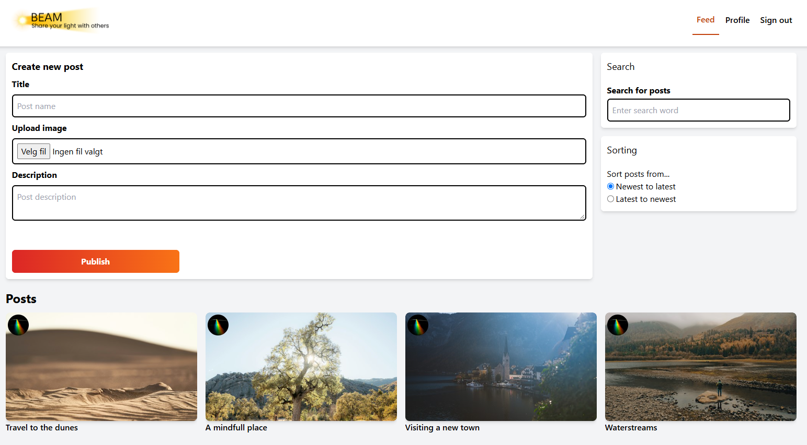

# CSS Frameworks - Beam



## Description

This is my project for the CSS Frameworks course. The project is a social media site with an authentication page, a profile page and a feed page. The site has been styled by using Tailwind. The project features the functionality of creating posts that is stored locally using localStorage and searching for posts.

## Built With

- HTML
- CSS
- TailwindCSS

## Feed features

- Create posts with an image, title, and description.
- Persist posts in the browser with `localStorage`.
- Search posts by title or description as you type.

## Getting Started

### Installing

1. Clone the repo:

```bash
git clone https://github.com/Andy19955/Beam.git
```

2. Install the dependencies:

```
npm install
```

### Running

To run the app, run the following commands:

```bash
npm run dev
```

## Contact

[LinkedIn (https://www.linkedin.com/in/andreas-thune/)](https://www.linkedin.com/in/andreas-thune/)
